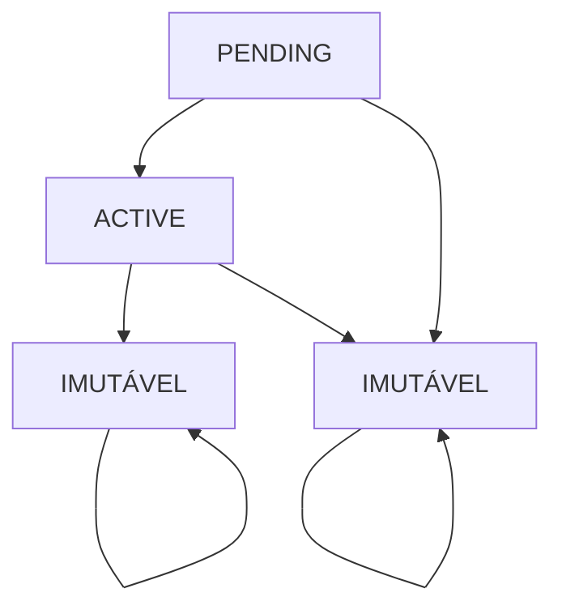

# 📋 Regras de Negócio - Sistema CRM de Eventos e Ingressos

## 🎯 Visão Geral

Este documento descreve todas as regras de negócio implementadas no sistema CRM para gestão de eventos e venda de ingressos. O sistema garante integridade dos dados, controle temporal rigoroso e experiência consistente para os usuários.

## 📚 Índice

- [Módulo de Eventos](#-módulo-de-eventos)
- [Módulo de Ingressos](#-módulo-de-ingressos)
- [Regras de Segurança](#-regras-de-segurança)
- [Validações e Controles](#-validações-e-controles)
- [Estados e Transições](#-estados-e-transições)
- [API Endpoints](#-api-endpoints)

---

## 🎪 Módulo de Eventos

### 1. Criação de Eventos

#### Validações Obrigatórias

- **Data Futura**: A data do evento não pode ser no passado
- **Horários Consistentes**: `startTime` deve ser anterior ao `endTime`
- **Capacidade Positiva**: `totalTickets` deve ser maior que zero
- **Preço Válido**: `price` não pode ser negativo

#### Comportamento

- Todo evento criado inicia com status `PENDING`
- Evento é automaticamente vinculado ao usuário criador
- Sistema gera timestamp de criação automático

```typescript
// Exemplo de validação temporal
if (eventDate < today) {
  throw new Error('A data do evento não pode ser no passado');
}
```

### 2. Listagem de Eventos

#### Funcionalidades

- **Paginação**: Suporte a `page` e `limit` (padrão: página 1, 10 itens)
- **Busca Textual**: Pesquisa em nome, descrição e localização (case-insensitive)
- **Filtros Avançados**:
  - Por status (`PENDING`, `ACTIVE`, `CANCELED`, `COMPLETED`)
  - Por intervalo de datas (`startDate` e `endDate`)

#### Informações Retornadas

- Dados completos do evento
- Contagem de ingressos vendidos (excluindo cancelados)
- Ingressos restantes (calculado automaticamente)
- Informações do criador do evento
- Metadata de paginação

### 3. Atualização de Eventos

#### Restrições de Proteção

- **Eventos em Andamento**: Não permite editar eventos `ACTIVE` que já iniciaram
- **Estados Finais**: Não permite editar eventos `CANCELED` ou `COMPLETED`
- **Capacidade Mínima**: Não permite reduzir `totalTickets` abaixo dos já vendidos

#### Validações na Atualização

- Nova data não pode ser no passado
- Novos horários devem ser consistentes (`startTime < endTime`)
- Novo preço não pode ser negativo

```typescript
// Proteção contra redução de capacidade
if (updateDto.totalTickets < ticketsSold) {
  throw new Error(`Não é possível reduzir para ${updateDto.totalTickets}. Já vendidos: ${ticketsSold}`);
}
```

### 4. Gestão de Status

#### Máquina de Estados



#### Regras de Transição

| Estado Atual | Estados Permitidos | Validações |
|--------------|-------------------|------------|
| `PENDING` | `ACTIVE`, `CANCELED` | Para `ACTIVE`: data não pode ter passado |
| `ACTIVE` | `COMPLETED`, `CANCELED` | Para `COMPLETED`: só após `endTime` |
| `CANCELED` | Nenhum | Estado final imutável |
| `COMPLETED` | Nenhum | Estado final imutável |

---

## 🎫 Módulo de Ingressos

### 1. Criação de Ingressos

#### Validações Críticas

- **Unicidade de CPF**: Um CPF só pode ter um ingresso ativo por evento
- **Controle de Limite**: Verifica disponibilidade antes de criar
- **Evento Válido**: Evento deve existir e estar acessível

#### Funcionalidades

- Geração automática de QR Code único (SHA256 do CPF)
- Status inicial sempre `PENDING`
- Rastreabilidade: vinculado ao usuário vendedor

```typescript
// Validação de unicidade
const existingTicket = await findTicketByCpfAndEvent(cpf, eventId);
if (existingTicket && existingTicket.status !== 'CANCELED') {
  throw new Error('CPF já possui ingresso para este evento');
}
```

### 2. Controle de Entrada

#### Confirmação de Entrada (`confirmEntry`)

**Validações Temporais Rigorosas:**

- ✅ Status deve ser `PENDING`
- ✅ Confirmação apenas no dia do evento
- ✅ Confirmação apenas durante horário do evento (`startTime ≤ agora ≤ endTime`)
- ✅ Apenas o vendedor pode confirmar

```typescript
// Validação temporal
const isEventDay = now.toDateString() === eventDate.toDateString();
const isWithinEventTime = now >= startTime && now <= endTime;

if (!isEventDay || !isWithinEventTime) {
  throw new Error('Confirmação só permitida durante o evento');
}
```

#### Cancelamento de Ingressos (`cancelTicket`)

**Regras de Proteção:**

- ✅ Status deve ser `PENDING`
- ✅ Não permite cancelar no dia do evento ou após
- ✅ Apenas o vendedor pode cancelar

### 3. Estados dos Ingressos

| Status | Descrição | Transições Permitidas |
|--------|-----------|---------------------|
| `PENDING` | Ingresso aguardando confirmação | `CONFIRMED`, `CANCELED` |
| `CONFIRMED` | Entrada confirmada no evento | Nenhuma (estado final) |
| `CANCELED` | Ingresso cancelado | Nenhuma (estado final) |

---

## 🔐 Regras de Segurança

### 1. Autenticação e Autorização

- **JWT Obrigatório**: Todos os endpoints protegidos
- **Rastreabilidade**: Todas as operações vinculadas ao usuário
- **Autorização Granular**: Apenas vendedor pode confirmar/cancelar ingressos

### 2. Controle de Acesso por Ambiente

- **Desenvolvimento**: DELETE permitido apenas em modo dev
- **Produção**: Operações destrutivas bloqueadas

### 3. Validação de Dados

- **DTOs Tipados**: Uso de class-validator em todos os inputs
- **Enums Seguros**: Estados controlados via Prisma enums
- **Sanitização**: Limpeza automática de strings

---

## ✅ Validações e Controles

### 1. Integridade Temporal

- **Datas Futuras**: Eventos só podem ser criados para datas futuras
- **Horários Lógicos**: Início sempre anterior ao fim
- **Janelas de Operação**: Confirmações/cancelamentos respeitam timing

### 2. Integridade de Dados

- **Unicidade**: CPF único por evento
- **Consistência**: Contadores sempre atualizados
- **Atomicidade**: Operações complexas em transações

### 3. Controle de Capacidade

- **Limite Respeitado**: Nunca vende além da capacidade
- **Cálculo Dinâmico**: Ingressos disponíveis calculados em tempo real
- **Exclusão Inteligente**: Cancelados não contam para limite

---

## 🔄 Estados e Transições

### Eventos

```
Criação → PENDING
    ↓
    ├─ ACTIVE (se data válida)
    └─ CANCELED

ACTIVE → COMPLETED (após endTime)
ACTIVE → CANCELED

CANCELED/COMPLETED → [IMUTÁVEL]
```

### Ingressos

```
Criação → PENDING
    ↓
    ├─ CONFIRMED (durante evento)
    └─ CANCELED (antes do evento)

CONFIRMED/CANCELED → [IMUTÁVEL]
```

---

## 🌐 API Endpoints

### Eventos

| Método | Endpoint | Descrição | Validações |
|--------|----------|-----------|------------|
| `GET` | `/events` | Lista eventos com filtros | Paginação, busca, filtros |
| `GET` | `/events/:id` | Busca evento específico | Evento deve existir |
| `POST` | `/events` | Criar evento | Data futura, horários válidos |
| `PATCH` | `/events/:id` | Atualizar evento | Proteções de estado |
| `PATCH` | `/events/:id/status` | Alterar status | Máquina de estados |
| `DELETE` | `/events/:id` | Deletar evento | Apenas dev mode |

### Ingressos

| Método | Endpoint | Descrição | Validações |
|--------|----------|-----------|------------|
| `GET` | `/tickets` | Lista ingressos | Por evento, paginação |
| `GET` | `/tickets/:id` | Busca ingresso específico | Ingresso deve existir |
| `POST` | `/tickets` | Criar ingresso | CPF único, capacidade |
| `PATCH` | `/tickets/:id` | Atualizar ingresso | CPF único se alterado |
| `POST` | `/tickets/confirm-entry` | Confirmar entrada | Validações temporais |
| `POST` | `/tickets/cancel` | Cancelar ingresso | Prazo e autorização |
| `DELETE` | `/tickets/:id` | Deletar ingresso | Apenas dev mode |

---

## 📊 Estatísticas e Relatórios

### 1. Métricas por Evento

- **Ingressos Vendidos**: Contagem excluindo cancelados
- **Ingressos Disponíveis**: Cálculo em tempo real
- **Taxa de Ocupação**: Percentual de venda

### 2. Informações de Paginação

- **Total de Registros**: Contagem precisa
- **Páginas Disponíveis**: Cálculo automático
- **Contexto de Busca**: Parâmetros utilizados

### 3. Auditoria

- **Criador**: Rastreamento de quem criou
- **Vendedor**: Rastreamento de quem vendeu
- **Timestamps**: Controle temporal completo

---

## 🚨 Casos de Erro Comuns

### 1. Criação de Eventos

- `400`: Data no passado, horários inválidos, capacidade/preço inválidos
- `401`: Token JWT inválido ou ausente

### 2. Venda de Ingressos

- `404`: Evento não encontrado
- `409`: CPF já possui ingresso no evento
- `400`: Evento esgotado

### 3. Confirmação de Entrada

- `400`: Fora do horário permitido, status inválido
- `404`: Ingresso não encontrado
- `401`: Usuário não autorizado

### 4. Cancelamento

- `400`: Prazo expirado, status inválido
- `401`: Usuário não autorizado

---

## 📝 Notas de Implementação

### 1. Performance

- Índices otimizados no banco de dados
- Consultas com `include` seletivo
- Paginação para grandes volumes

### 2. Escalabilidade

- Transações atômicas para consistência
- Validações no nível da aplicação
- Cache potencial para consultas frequentes

### 3. Manutenibilidade

- Código tipado com TypeScript
- Validações centralizadas em DTOs
- Separação clara de responsabilidades

---

**Documento atualizado em:** Junho 2025
**Versão da API:** 1.0.0
**Última revisão:** Implementação completa das regras de negócio
